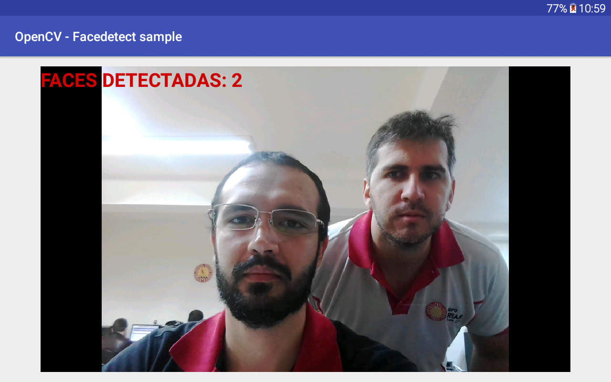

# Native OpenCV in Android Studio with face detect

This application is a sample of the `OpenCV` in Android. 
In the sample we use the [OpenCV SDK](https://sourceforge.net/projects/opencvlibrary/files/opencv-android/)
 to detect faces.

The application has been tested with:

* Android Compile SDK '28'
* Android Build Tools '28.0.3'
* Gradle '3.4.2'
* OpenCV SDK '3.4.3'

## Configuration / Usage:

Here is how to use this project to run native `OpenCV` code.

* Make sure you have `Android SDK` up to date, with `NDK` installed
* Download [OpenCV SDK 3.4.3](https://sourceforge.net/projects/opencvlibrary/files/opencv-android/) for Android from OpenCV.org and decompress the zip file.
* Clone [this project](https://github.com/gbzarelli/AndroidFaceDetectOpenCV)
* Create a symlink named `jniLibs` in `app/src/main` that points to `${YOUR_HOME_OPENCV_SDK}/sdk/native/libs`
* In `app/CMakeLists.txt` change line 9 to points to `${YOUR_HOME_OPENCV_SDK}/sdk/native/jni/include`
* Sync gradle
* Run the application

### Notes:

- The openCVLibaray343 library inside the project contains the java code of 
`/openCVLibrary343/src/main/java`, copied from the `${YOUR_HOME_OPENCV_SDK}/sdk/java/src` folder.

- The aidl folder `/openCVLibrary343/src/main/aidl` contains the contents 
of `${YOUR_HOME_OPENCV_SDK}/sdk/java/src/org/opencv/engine` folder, 
keeping the same package.

- For detection we are using a `Haar Cascade` frontal face detection 
inserted in `res/raw/haarcascade_frontalface_alt.xml` ( We can find other 
Haar at: [GitHub Link](https://github.com/opencv/opencv/tree/master/data/haarcascades) )

----

## Sample App Image

### References

 - https://github.com/leadrien/opencv_native_androidstudio